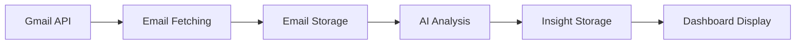

# Trellin MVP - Comprehensive Flow Documentation

## 🎯 Executive Summary

**Trellin** is an AI-powered Customer Success Platform designed for retainer-based businesses. The MVP addresses the core pain point: CEOs and business owners lacking visibility into customer satisfaction and team performance.

### Core Value Proposition
- **Answer**: "How is it going with my customers?"
- **Assess**: "Is there a problem I need to handle or can I relax?"
- **Monitor**: "Did my team follow up on everything that needs to be handled?"
- **Track**: "Are our customers happy?"

## 🏗️ System Architecture

### Technology Stack
- **Backend**: Node.js + Express + Drizzle ORM + PostgreSQL
- **Frontend**: React + TypeScript + Vite + Tailwind CSS + Shadcn/ui
- **AI**: Azure OpenAI GPT-4 for comprehensive analysis
- **Database**: PostgreSQL with Drizzle ORM
- **Authentication**: JWT-based auth with Google OAuth support

### Database Schema Overview
```
Users (Platform users/CEOs)
├── Employees (Customer Success Managers)
├── Customers (Client companies)
│   ├── Projects (High-level task groupings)
│   └── Tasks (Individual work items)
├── EmailLogs (Email communication history)
│   └── EmailInsights (AI analysis results)
├── CustomerUpdates (Sentiment tracking)
└── DailySummaries (Executive reports)
```

## 🔄 Complete MVP Flow

### 1. Data Ingestion & Processing Pipeline

#### Email Collection & Storage


**Process Flow:**
1. **Email Sync**: Backend fetches emails via Gmail API (OAuth 2.0)
2. **Data Storage**: Emails stored in `email_logs` table with metadata
3. **AI Processing**: Each email analyzed for sentiment, summary, and action items
4. **Insight Generation**: AI creates structured insights stored in `email_insights`
5. **Customer Mapping**: Emails linked to customers based on domain/email patterns

#### AI Analysis Pipeline
```javascript
// Email Analysis Process
analyzeEmail(emailData) {
  // 1. Sentiment Analysis (happy/neutral/unhappy)
  // 2. Content Summarization
  // 3. Action Item Extraction
  // 4. Risk Assessment
  // 5. Response Time Analysis
}
```

### 2. Customer Intelligence Engine

#### Customer Sentiment Tracking
- **Real-time Analysis**: Every customer email analyzed for sentiment
- **Historical Patterns**: AI identifies trends in customer satisfaction
- **Risk Assessment**: Flags customers showing dissatisfaction signals
- **Engagement Metrics**: Tracks communication frequency and quality

#### Customer Detail Analysis
```javascript
// Customer Analysis Output
{
  satisfaction: 8.5, // 1-10 scale
  happyPoints: ["Website performance", "Support responsiveness"],
  unhappyPoints: ["Billing confusion", "Feature delays"],
  activeProjects: ["Mobile app development", "SEO optimization"],
  waitingFor: ["API documentation", "Pricing proposal"],
  riskLevel: "medium"
}
```

### 3. Employee Performance Monitoring

#### Performance Metrics
- **Response Time**: Average reply time to customer emails
- **Task Completion**: Rate of completed vs. assigned tasks
- **Customer Satisfaction**: Based on email sentiment analysis
- **Activity Tracking**: Last active time and engagement levels

#### Employee Analysis
```javascript
// Employee Performance Data
{
  performanceScore: 85, // 0-100 scale
  responsivenessScore: 92,
  strengths: ["Quick problem resolution", "Proactive communication"],
  areasForImprovement: ["Documentation", "Follow-up consistency"],
  recentActivity: ["Resolved billing issue", "Updated project timeline"]
}
```

### 4. Executive Dashboard System

#### Q&A Dashboard (Primary Interface)
The main dashboard answers 6 critical business questions:

1. **"How is it going with my customers?"**
   - Overall satisfaction metrics
   - Trend analysis and patterns
   - Risk assessment and alerts

2. **"Are our customers happy?"**
   - Sentiment distribution
   - Specific feedback themes
   - Satisfaction trends over time

3. **"Is there a problem I need to handle?"**
   - Flagged issues requiring attention
   - Urgency assessment
   - Impact analysis

4. **"Can I relax or take action?"**
   - Action vs. relaxation recommendation
   - Risk-based decision framework
   - Priority assessment

5. **"Did my team follow up on everything?"**
   - Follow-up completion rates
   - Pending action items
   - Response quality assessment

6. **"How is my team performing?"**
   - Individual performance metrics
   - Team productivity analysis
   - Improvement recommendations

#### Dashboard Components
```typescript
// Dashboard Data Structure
interface QADashboardData {
  metrics: {
    totalEmails: number;
    happyCustomers: number;
    unhappyCustomers: number;
    totalEmployees: number;
    activeEmployees: number;
    avgReplyTime: number;
  };
  analysis: {
    customerStatusAnswer: string;
    customerHappinessAnswer: string;
    problemHandlingAnswer: string;
    relaxationStatusAnswer: string;
    teamFollowUpAnswer: string;
    teamPerformanceAnswer: string;
  };
  customerDetails: CustomerDetail[];
  employeePerformance: EmployeePerformanceDetail[];
}
```

### 5. AI-Powered Insights Engine

#### Comprehensive Analysis System
The AI service provides multiple layers of analysis:

1. **Email-Level Analysis**
   - Sentiment classification
   - Content summarization
   - Action item extraction
   - Risk flagging

2. **Customer-Level Analysis**
   - Overall satisfaction scoring
   - Trend identification
   - Risk assessment
   - Recommendation generation

3. **Employee-Level Analysis**
   - Performance scoring
   - Strength identification
   - Improvement areas
   - Activity tracking

4. **Executive-Level Analysis**
   - Daily summaries
   - Strategic insights
   - Risk assessment
   - Action recommendations

#### AI Service Architecture
```javascript
// AI Service Functions
export const aiService = {
  analyzeEmail,              // Single email analysis
  analyzeCustomerSentiment,  // Customer history analysis
  analyzeEmployeePerformance, // Employee metrics analysis
  generateDailySummary,      // Executive reports
  analyzeQADashboard,        // Comprehensive Q&A analysis
  analyzeCustomerDetail,     // Detailed customer insights
  analyzeEmployeeDetail,     // Detailed employee insights
  performComprehensiveAnalysis // Maximum detail analysis
};
```

### 6. Frontend User Experience

#### Dashboard Views
1. **Question & Answer Dashboard** (Primary)
   - 6 key business questions
   - Real-time AI analysis
   - Customer and employee details

2. **Customer Success Dashboard**
   - Detailed customer analysis
   - Satisfaction tracking
   - Project status

3. **Specific Queries Dashboard**
   - Custom customer/employee queries
   - Detailed analysis results

4. **System Overview**
   - High-level metrics
   - System health status

#### UI Components
```typescript
// Main Dashboard Components
- QuestionAnswerDashboard    // Primary Q&A interface
- CustomerSuccessDashboard   // Detailed customer view
- SpecificQueries          // Custom analysis
- SystemOverview           // System metrics
- CustomerList            // Customer overview
- EmployeePerformance     // Team performance
```

### 7. API Architecture

#### Backend Routes Structure
```
/api/v1/
├── auth/                    # Authentication
├── users/                   # User management
├── customers/               # Customer CRUD
├── ai/                      # AI analysis endpoints
└── insights/                # Dashboard data
    ├── dashboard           # Main dashboard
    ├── daily-summary       # Daily reports
    ├── emails             # Email insights
    ├── customers          # Customer data
    ├── employees          # Employee data
    └── qa-analysis        # Q&A dashboard
```

#### Key API Endpoints
```javascript
// Dashboard Data
GET /api/v1/insights/qa-analysis          // Q&A dashboard data
GET /api/v1/insights/dashboard            // Main dashboard
GET /api/v1/insights/daily-summary        // Daily summary
GET /api/v1/insights/customers            // Customer list
GET /api/v1/insights/employees            // Employee list

// AI Analysis
POST /api/v1/ai/analyze-email             // Email analysis
POST /api/v1/ai/analyze-customer-sentiment // Customer analysis
POST /api/v1/ai/generate-daily-summary    // Summary generation

// Detailed Analysis
GET /api/v1/insights/customers/:id/analysis    // Customer details
GET /api/v1/insights/employees/:id/analysis    // Employee details
```

### 8. Data Flow & Processing

#### Real-time Data Processing
1. **Email Ingestion**
   - Gmail API integration
   - Email parsing and storage
   - Customer/employee mapping

2. **AI Analysis**
   - Sentiment analysis
   - Content summarization
   - Action item extraction
   - Risk assessment

3. **Insight Generation**
   - Customer satisfaction scoring
   - Employee performance metrics
   - Trend identification
   - Recommendation generation

4. **Dashboard Updates**
   - Real-time metric updates
   - AI analysis results
   - Alert generation
   - Report generation

#### Data Relationships
```sql
-- Core Data Relationships
Users (1) → (Many) Customers
Users (1) → (Many) Employees
Customers (1) → (Many) EmailLogs
Employees (1) → (Many) EmailLogs
EmailLogs (1) → (1) EmailInsights
Customers (1) → (Many) CustomerUpdates
```

### 9. Security & Authentication

#### Authentication Flow
1. **Google OAuth 2.0** for user authentication
2. **JWT tokens** for session management
3. **Role-based access** control
4. **API key protection** for AI services

#### Security Features
- **Helmet.js** for security headers
- **CORS** configuration for frontend access
- **Rate limiting** on API endpoints
- **Input validation** on all endpoints
- **Error handling** with sanitized messages

### 10. Development & Deployment

#### Development Environment
```bash
# Backend Setup
cd backend
pnpm install
pnpm db:migrate
pnpm seed:emails
pnpm dev

# Frontend Setup
cd frontend
pnpm install
pnpm dev
```

#### Key Scripts
```json
{
  "scripts": {
    "dev": "Start development server",
    "seed:emails": "Populate database with test data",
    "test:ai": "Test AI functionality",
    "test:data": "Verify data population",
    "db:migrate": "Run database migrations"
  }
}
```

## 🎯 MVP Success Metrics

### Quantitative Metrics
- **Customer Satisfaction**: Track sentiment trends
- **Response Time**: Monitor team responsiveness
- **Task Completion**: Measure productivity
- **Risk Reduction**: Flag issues early

### Qualitative Metrics
- **Executive Confidence**: "Can I relax?" answers
- **Problem Detection**: Early issue identification
- **Team Visibility**: Performance transparency
- **Customer Retention**: Reduced churn risk

## 🚀 Future Enhancements

### Phase 2 Features
1. **Real-time Email Sync**: Live Gmail integration
2. **Automated Alerts**: Proactive issue detection
3. **Advanced Analytics**: Predictive insights
4. **Mobile App**: iOS/Android applications
5. **API Integrations**: CRM and project management tools

### Technical Improvements
1. **WebSocket Support**: Real-time updates
2. **Caching Layer**: Redis for performance
3. **Microservices**: Service decomposition
4. **Advanced AI**: Custom model training
5. **Scalability**: Horizontal scaling support

## 📊 Current MVP Status

### ✅ Completed Features
- [x] Complete database schema with relationships
- [x] AI-powered email analysis system
- [x] Customer sentiment tracking
- [x] Employee performance monitoring
- [x] Q&A dashboard with 6 key questions
- [x] Comprehensive API architecture
- [x] React frontend with multiple views
- [x] Authentication system
- [x] Test data seeding (70+ emails)
- [x] AI analysis for all data points

### 🔄 In Progress
- [ ] Real Gmail API integration
- [ ] Production deployment
- [ ] Performance optimization
- [ ] Advanced analytics

### 📋 Next Steps
1. **Production Deployment**: Deploy to cloud infrastructure
2. **Real Data Integration**: Connect to actual Gmail accounts
3. **User Testing**: Gather feedback from target users
4. **Feature Refinement**: Iterate based on usage data
5. **Scale Preparation**: Plan for growth and scaling

## 🎉 Conclusion

The Trellin MVP provides a comprehensive solution for customer success management, addressing the core pain points of business owners who need visibility into customer satisfaction and team performance. The AI-powered platform transforms email communication into actionable insights, enabling data-driven decision making and proactive customer success management.

The system is designed to scale from MVP to full production, with a solid foundation that supports future enhancements and integrations. The combination of real-time data processing, AI analysis, and intuitive dashboard design creates a powerful tool for customer success teams.
