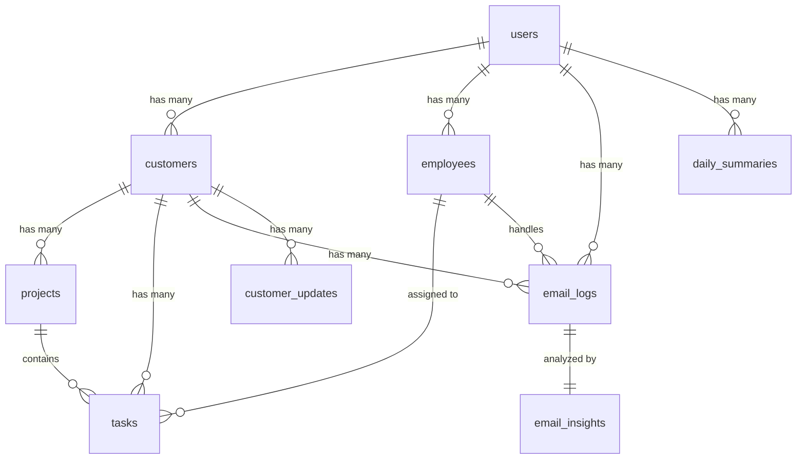

# Trellin MVP - Complete Database Design

## 🗄️ Database Overview

The Trellin MVP uses **PostgreSQL** with **Drizzle ORM** for type-safe database operations. The database is designed to support AI-powered customer success management with comprehensive email analysis, customer tracking, and employee performance monitoring.

## 📊 Database Schema

### Core Tables Structure

```
Users (Platform users/CEOs)
├── Employees (Customer Success Managers)
├── Customers (Client companies)
│   ├── Projects (High-level task groupings)
│   └── Tasks (Individual work items)
├── EmailLogs (Email communication history)
│   └── EmailInsights (AI analysis results)
├── CustomerUpdates (Sentiment tracking)
└── DailySummaries (Executive reports)
```

## 🏗️ Detailed Table Design

### 1. **users** - Platform Users (CEOs/Business Owners)

**Purpose**: Store platform users who are CEOs or business owners managing customer success.

```sql
CREATE TABLE users (
    id UUID PRIMARY KEY DEFAULT gen_random_uuid(),
    name TEXT NOT NULL,
    email TEXT UNIQUE NOT NULL,
    company_name TEXT,
    created_at TIMESTAMP DEFAULT NOW()
);
```

**Usage**:
- **Authentication**: Primary user accounts for platform access
- **Data Isolation**: All other data is scoped to specific users
- **Company Management**: Each user represents a business/agency

**Key Relationships**:
- `users.id` → `customers.user_id` (One user has many customers)
- `users.id` → `employees.user_id` (One user has many employees)
- `users.id` → `email_logs.user_id` (One user has many emails)

### 2. **employees** - Customer Success Team Members

**Purpose**: Track customer success managers and team members who handle customer relationships.

```sql
CREATE TABLE employees (
    id UUID PRIMARY KEY DEFAULT gen_random_uuid(),
    name TEXT NOT NULL,
    email TEXT NOT NULL,
    role TEXT DEFAULT 'Customer Success Manager',
    user_id UUID REFERENCES users(id) ON DELETE CASCADE,
    last_active TIMESTAMP,
    total_tasks INTEGER DEFAULT 0,
    completed_tasks INTEGER DEFAULT 0,
    pending_tasks INTEGER DEFAULT 0,
    overdue_tasks INTEGER DEFAULT 0,
    responsiveness_score REAL DEFAULT 0,
    avg_reply_time REAL DEFAULT 0,
    active BOOLEAN DEFAULT true,
    created_at TIMESTAMP DEFAULT NOW()
);
```

**Usage**:
- **Performance Tracking**: Monitor employee productivity and responsiveness
- **Task Management**: Track task completion rates and deadlines
- **Activity Monitoring**: Track last active time and engagement
- **Customer Assignment**: Link employees to customer interactions

**Key Metrics Tracked**:
- `responsiveness_score`: Percentage of emails replied within X hours
- `avg_reply_time`: Average response time in minutes
- `total_tasks` vs `completed_tasks`: Task completion rate
- `overdue_tasks`: Risk assessment metric

### 3. **customers** - Client Companies

**Purpose**: Store customer/client information and track their satisfaction levels.

```sql
CREATE TABLE customers (
    id UUID PRIMARY KEY DEFAULT gen_random_uuid(),
    user_id UUID REFERENCES users(id) ON DELETE CASCADE,
    name TEXT NOT NULL,
    primary_domain TEXT,
    known_emails JSON,
    overall_sentiment TEXT DEFAULT 'neutral',
    flagged_issues BOOLEAN DEFAULT false,
    current_projects JSON,
    waiting_on JSON,
    last_email_date TIMESTAMP,
    notes TEXT,
    created_at TIMESTAMP DEFAULT NOW()
);
```

**Usage**:
- **Customer Management**: Store client information and contact details
- **Sentiment Tracking**: Track overall customer satisfaction
- **Project Tracking**: Monitor active projects and deliverables
- **Risk Assessment**: Flag customers with issues requiring attention

**Key Fields**:
- `overall_sentiment`: AI-determined sentiment (happy/neutral/unhappy)
- `flagged_issues`: Boolean flag for customers needing attention
- `current_projects`: JSON array of active projects
- `waiting_on`: JSON array of items customer is waiting for

### 4. **projects** - High-level Task Groupings

**Purpose**: Group related tasks and work items for each customer.

```sql
CREATE TABLE projects (
    id UUID PRIMARY KEY DEFAULT gen_random_uuid(),
    customer_id UUID REFERENCES customers(id) ON DELETE CASCADE,
    name TEXT NOT NULL,
    description TEXT,
    status TEXT DEFAULT 'active',
    start_date DATE,
    end_date DATE,
    created_at TIMESTAMP DEFAULT NOW()
);
```

**Usage**:
- **Work Organization**: Group related tasks and deliverables
- **Project Tracking**: Monitor project status and timelines
- **Customer Context**: Provide structure for customer work

**Status Values**:
- `active`: Currently in progress
- `completed`: Finished successfully
- `paused`: Temporarily on hold

### 5. **tasks** - Individual Work Items

**Purpose**: Track specific tasks, deliverables, and action items.

```sql
CREATE TABLE tasks (
    id UUID PRIMARY KEY DEFAULT gen_random_uuid(),
    customer_id UUID REFERENCES customers(id) ON DELETE CASCADE,
    project_id UUID REFERENCES projects(id) ON DELETE SET NULL,
    assigned_to UUID REFERENCES employees(id) ON DELETE SET NULL,
    description TEXT NOT NULL,
    status TEXT DEFAULT 'open',
    due_date DATE,
    completed_at TIMESTAMP,
    is_late BOOLEAN DEFAULT false,
    created_at TIMESTAMP DEFAULT NOW()
);
```

**Usage**:
- **Task Management**: Track individual work items and deliverables
- **Assignment Tracking**: Link tasks to specific employees
- **Deadline Monitoring**: Track due dates and completion status
- **Performance Metrics**: Calculate completion rates and overdue tasks

**Status Values**:
- `open`: New task, not started
- `in-progress`: Currently being worked on
- `completed`: Finished successfully

### 6. **email_logs** - Email Communication History

**Purpose**: Store all email communications with AI analysis metadata.

```sql
CREATE TABLE email_logs (
    id UUID PRIMARY KEY DEFAULT gen_random_uuid(),
    user_id UUID REFERENCES users(id) ON DELETE CASCADE,
    employee_id UUID REFERENCES employees(id) ON DELETE SET NULL,
    customer_id UUID REFERENCES customers(id) ON DELETE SET NULL,
    from_email TEXT NOT NULL,
    to_email TEXT NOT NULL,
    subject TEXT,
    body TEXT,
    timestamp TIMESTAMP NOT NULL,
    sentiment TEXT,
    summary TEXT,
    action_needed BOOLEAN DEFAULT false,
    replied BOOLEAN DEFAULT false,
    reply_time_minutes INTEGER,
    created_at TIMESTAMP DEFAULT NOW()
);
```

**Usage**:
- **Communication Tracking**: Store all email interactions
- **AI Analysis**: Base data for sentiment and content analysis
- **Response Tracking**: Monitor reply times and follow-up status
- **Customer Mapping**: Link emails to specific customers and employees

**Key Metrics**:
- `sentiment`: AI-determined email sentiment (happy/neutral/unhappy)
- `action_needed`: Flag for emails requiring immediate attention
- `reply_time_minutes`: Response time for tracking responsiveness
- `replied`: Boolean indicating if email was responded to

### 7. **email_insights** - AI Analysis Results

**Purpose**: Store detailed AI analysis results for each email.

```sql
CREATE TABLE email_insights (
    id UUID PRIMARY KEY DEFAULT gen_random_uuid(),
    email_id UUID REFERENCES email_logs(id) ON DELETE CASCADE,
    sentiment TEXT,
    summary TEXT,
    waiting_for TEXT,
    recommended_action TEXT,
    is_flagged BOOLEAN DEFAULT false,
    created_at TIMESTAMP DEFAULT NOW()
);
```

**Usage**:
- **AI Analysis Storage**: Store detailed analysis results
- **Action Items**: Track what customers are waiting for
- **Recommendations**: Store AI-generated action recommendations
- **Risk Assessment**: Flag emails requiring immediate attention

**Analysis Results**:
- `sentiment`: Detailed sentiment analysis
- `summary`: AI-generated email summary
- `waiting_for`: What the customer is waiting for
- `recommended_action`: AI-suggested next steps

### 8. **customer_updates** - Sentiment Tracking History

**Purpose**: Track customer sentiment changes over time.

```sql
CREATE TABLE customer_updates (
    id UUID PRIMARY KEY DEFAULT gen_random_uuid(),
    customer_id UUID REFERENCES customers(id) ON DELETE CASCADE,
    type TEXT NOT NULL,
    summary TEXT,
    date DATE NOT NULL,
    created_at TIMESTAMP DEFAULT NOW()
);
```

**Usage**:
- **Sentiment History**: Track customer satisfaction changes over time
- **Trend Analysis**: Identify patterns in customer satisfaction
- **Historical Context**: Provide timeline of customer relationship

**Type Values**:
- `happy`: Positive sentiment update
- `unhappy`: Negative sentiment update

### 9. **daily_summaries** - Executive Reports

**Purpose**: Store daily executive summary reports for business owners.

```sql
CREATE TABLE daily_summaries (
    id UUID PRIMARY KEY DEFAULT gen_random_uuid(),
    user_id UUID REFERENCES users(id) ON DELETE CASCADE,
    date DATE NOT NULL,
    total_customers INTEGER DEFAULT 0,
    happy_customers INTEGER DEFAULT 0,
    unhappy_customers INTEGER DEFAULT 0,
    flagged_customers JSON,
    total_tasks INTEGER DEFAULT 0,
    open_tasks INTEGER DEFAULT 0,
    overdue_tasks INTEGER DEFAULT 0,
    top_issues JSON,
    created_at TIMESTAMP DEFAULT NOW()
);
```

**Usage**:
- **Executive Reporting**: Daily summaries for business owners
- **Trend Analysis**: Track metrics over time
- **Dashboard Data**: Provide aggregated metrics for dashboards
- **Historical Records**: Maintain historical performance data

## 🔗 Table Relationships

### Primary Relationships



### Foreign Key Relationships

| Table | Foreign Key | References | Purpose |
|-------|-------------|------------|---------|
| `customers` | `user_id` | `users.id` | Link customers to business owner |
| `employees` | `user_id` | `users.id` | Link employees to business owner |
| `projects` | `customer_id` | `customers.id` | Link projects to customers |
| `tasks` | `customer_id` | `customers.id` | Link tasks to customers |
| `tasks` | `project_id` | `projects.id` | Link tasks to projects |
| `tasks` | `assigned_to` | `employees.id` | Assign tasks to employees |
| `email_logs` | `user_id` | `users.id` | Link emails to business owner |
| `email_logs` | `customer_id` | `customers.id` | Link emails to customers |
| `email_logs` | `employee_id` | `employees.id` | Link emails to employees |
| `email_insights` | `email_id` | `email_logs.id` | Link insights to emails |
| `customer_updates` | `customer_id` | `customers.id` | Link updates to customers |
| `daily_summaries` | `user_id` | `users.id` | Link summaries to business owner |

## 📊 Data Usage by Feature

### 1. **Q&A Dashboard** (`/api/v1/insights/qa-analysis`)

**Tables Used**:
- `email_logs` - Email data and sentiment
- `customers` - Customer information and satisfaction
- `employees` - Employee performance metrics
- `email_insights` - AI analysis results

**Data Flow**:
1. Query all emails for user
2. Calculate sentiment distribution
3. Aggregate customer satisfaction metrics
4. Calculate employee performance scores
5. Generate AI analysis for 6 business questions

### 2. **Customer Analysis** (`/api/v1/insights/customers/:id/analysis`)

**Tables Used**:
- `customers` - Customer base information
- `email_logs` - Customer communication history
- `email_insights` - AI analysis of customer emails
- `customer_updates` - Sentiment change history

**Data Flow**:
1. Get customer details from `customers`
2. Query all emails for specific customer
3. Analyze email history with AI
4. Generate satisfaction score and recommendations

### 3. **Employee Performance** (`/api/v1/insights/employees/:id/analysis`)

**Tables Used**:
- `employees` - Employee information and metrics
- `email_logs` - Employee communication history
- `tasks` - Task assignment and completion data

**Data Flow**:
1. Get employee details from `employees`
2. Query emails handled by employee
3. Calculate response times and satisfaction scores
4. Analyze task completion rates
5. Generate performance recommendations

### 4. **Daily Summary** (`/api/v1/insights/daily-summary`)

**Tables Used**:
- `daily_summaries` - Historical summary data
- `email_logs` - Today's email activity
- `customers` - Customer satisfaction metrics
- `tasks` - Task completion data

**Data Flow**:
1. Query today's emails and sentiment
2. Calculate customer satisfaction metrics
3. Aggregate task completion data
4. Generate AI-powered daily summary
5. Store in `daily_summaries` for historical tracking

### 5. **Email Insights** (`/api/v1/insights/emails`)

**Tables Used**:
- `email_logs` - Email data
- `email_insights` - AI analysis results
- `customers` - Customer information
- `employees` - Employee information

**Data Flow**:
1. Query emails with customer and employee details
2. Include AI analysis from `email_insights`
3. Provide comprehensive email view with context

## 🔍 Key Queries by Feature

### Q&A Dashboard Query
```sql
-- Get comprehensive data for Q&A dashboard
SELECT 
    el.*,
    c.name as customer_name,
    e.name as employee_name,
    ei.sentiment,
    ei.summary,
    ei.action_needed
FROM email_logs el
LEFT JOIN customers c ON el.customer_id = c.id
LEFT JOIN employees e ON el.employee_id = e.id
LEFT JOIN email_insights ei ON el.id = ei.email_id
WHERE el.user_id = $1
ORDER BY el.timestamp DESC;
```

### Customer Analysis Query
```sql
-- Get customer with email history
SELECT 
    c.*,
    COUNT(el.id) as email_count,
    MAX(el.timestamp) as last_email_date
FROM customers c
LEFT JOIN email_logs el ON c.id = el.customer_id
WHERE c.user_id = $1
GROUP BY c.id, c.name, c.overall_sentiment;
```

### Employee Performance Query
```sql
-- Get employee with performance metrics
SELECT 
    e.*,
    COUNT(el.id) as email_count,
    AVG(el.reply_time_minutes) as avg_reply_time
FROM employees e
LEFT JOIN email_logs el ON e.id = el.employee_id
WHERE e.user_id = $1
GROUP BY e.id, e.name, e.performance_score;
```

## 🎯 Database Optimization

### Indexes for Performance
```sql
-- Email logs for fast customer/employee queries
CREATE INDEX idx_email_logs_user_id ON email_logs(user_id);
CREATE INDEX idx_email_logs_customer_id ON email_logs(customer_id);
CREATE INDEX idx_email_logs_employee_id ON email_logs(employee_id);
CREATE INDEX idx_email_logs_timestamp ON email_logs(timestamp);

-- Customer queries
CREATE INDEX idx_customers_user_id ON customers(user_id);
CREATE INDEX idx_customers_sentiment ON customers(overall_sentiment);

-- Employee queries
CREATE INDEX idx_employees_user_id ON employees(user_id);
CREATE INDEX idx_employees_active ON employees(active);

-- Task queries
CREATE INDEX idx_tasks_customer_id ON tasks(customer_id);
CREATE INDEX idx_tasks_assigned_to ON tasks(assigned_to);
CREATE INDEX idx_tasks_status ON tasks(status);
```

### Data Retention Strategy
- **Email Logs**: Keep for 2 years for trend analysis
- **Email Insights**: Keep for 2 years for historical analysis
- **Customer Updates**: Keep indefinitely for relationship history
- **Daily Summaries**: Keep for 5 years for business intelligence

## 🔧 Database Maintenance

### Regular Tasks
1. **Data Cleanup**: Archive old email logs monthly
2. **Performance Monitoring**: Check query performance weekly
3. **Backup Strategy**: Daily backups with point-in-time recovery
4. **Index Maintenance**: Rebuild indexes monthly

### Monitoring Queries
```sql
-- Check data distribution
SELECT 
    COUNT(*) as total_emails,
    COUNT(DISTINCT customer_id) as unique_customers,
    COUNT(DISTINCT employee_id) as unique_employees
FROM email_logs 
WHERE user_id = $1;

-- Check AI analysis coverage
SELECT 
    COUNT(*) as total_emails,
    COUNT(ei.id) as analyzed_emails,
    ROUND(COUNT(ei.id) * 100.0 / COUNT(*), 2) as analysis_coverage
FROM email_logs el
LEFT JOIN email_insights ei ON el.id = ei.email_id
WHERE el.user_id = $1;
```

## 📈 Scalability Considerations

### Current MVP Capacity
- **Users**: 1-10 business owners
- **Customers**: 10-100 per user
- **Employees**: 5-20 per user
- **Emails**: 1000-10000 per month per user

### Future Scaling
- **Sharding**: Partition by user_id for multi-tenant scaling
- **Read Replicas**: Separate read/write operations
- **Caching**: Redis for frequently accessed data
- **Archiving**: Move old data to cheaper storage

This database design provides a solid foundation for the Trellin MVP while supporting future growth and advanced features.
